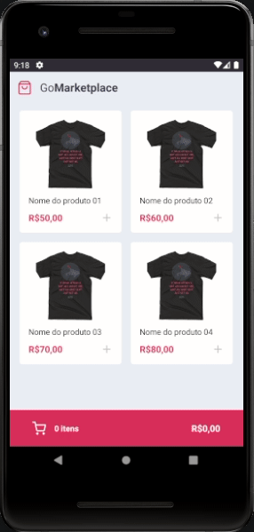

<h1 align="center">Challenge #8 - Go MarketPlace: Mobile APP - Rocketseat bootcamp GoStack</h1>

<h2>:computer: About</h2>
The purpose of this project is to complete the #8 Challenge of the Rocketseat GoStack 12 Bootcamp!<br>
https://github.com/Rocketseat/bootcamp-gostack-desafios/tree/master/desafio-fundamentos-react-native

---



---

<h2>:computer: What is supposed to do?</h2>
This challenges consists in create a mobile App (shopping cart) using React-Native, capable of list all products, add and remove items on cart, also sum total itens and total price.
<ul>
<li>Should be able to list the products</li>
<li>Should be able to add a product to the cart</li>
<li>Should be able to list the products on the cart</li>
<li>Should be able to calculate the cart total</li>
<li>Should be able to show the total quantity of itens in the cart</li>
<li>Should be able to increment product quantity on the cart</li>
<li>Should be able to decrement product quantity on the cart</li>
<li>Should be able to navigate to the cart</li>
<li>Should be able to add products to the cart</li>
<li>Should be able to increment quantity</li>
<li>Should be able to decrement quantity</li>
<li>Should store products in AsyncStorage while adding, incrementing and decrementing</li>
<li>Should load products from AsyncStorage</li>
</ul>

---

<h2>:toolbox: What did I use?</h2>

- [React-Native](https://reactnative.dev/)
- [Axios](https://github.com/axios/axios/)
- [TypeScript](https://www.typescriptlang.org/)

<small>The tests were provided by rocketseat staff!</small>

---

<h2>:heavy_check_mark: Check the project</h2>

#### Running the project
```bash
# Step 1 (clone the repository):

$ git clone https://github.com/victorfclima/go-marketplace.git

# Step 2 (install the dependencies):

$ yarn

# Step 3 (run the fake API):

$ yarn server

# Step 4 (Initialize bundle):

$ yarn start

# Step 5 (Initialize app on emulator):

$ yarn android
```
